# 🍎 Global Retail Data Platform

> A production-grade, end-to-end real-time data engineering pipeline that simulates how global retailers like Apple process millions of transactions — from raw event generation to a live analytics dashboard.


> 🎬 **Demo Video:** [Watch here](https://youtu.be/WfVg-zzc0X0)

---

## 📌 Overview

Most data engineering projects use static CSVs and random numbers. This one doesn't.

This project simulates a **real-time, global retail data platform** — 15 stores across 10 countries generating live Point-of-Sale transactions, streamed through Kafka, processed by Spark, stored in a Bronze-Silver-Gold data lake, queried by DuckDB, and visualized in a live Streamlit dashboard that auto-refreshes every 30 seconds.

Every design decision mirrors what you'd find in a production data platform at companies like Uber, Netflix, or Amazon.

---

## 🏗️ System Architecture

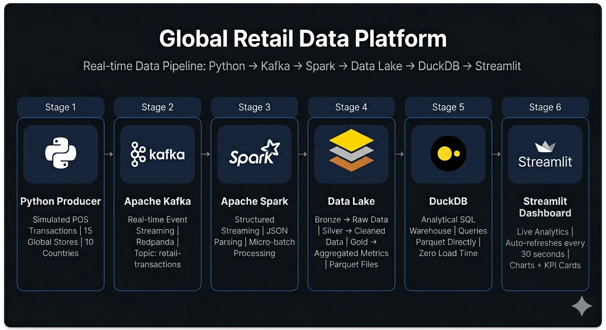

---

## 🚧 Project Roadmap

| Phase | Component | Technology | Status |
|---|---|---|---|
| 1 | Data Generation | Python Producer + QA Suite | ✅ Complete |
| 2 | Streaming | Apache Kafka (Redpanda) + Docker | ✅ Complete |
| 3 | Stream Processing | Apache Spark Structured Streaming | ✅ Complete |
| 4 | Data Lake | Bronze / Silver / Gold (Parquet) | ✅ Complete |
| 5 | Warehouse | DuckDB | ✅ Complete |
| 6 | Dashboard | Streamlit (Live, auto-refreshing) | ✅ Complete |

---

## 📁 Project Structure

```
global-retail-data-platform/
│
├── data_generator/
│   ├── producer.py           # Real-time transaction generator
│   └── test_producer.py      # QA validation suite
│
├── kafka/
│   └── docker-compose.yml    # Redpanda setup
│
├── spark/
│   ├── spark_stream.py       # Console stream viewer
│   ├── bronze_writer.py      # Raw data lake writer
│   ├── silver_writer.py      # Cleaned data writer
│   └── gold_writer.py        # Aggregated metrics writer
│
├── warehouse/
│   ├── warehouse.py          # DuckDB SQL analytics
│   └── export_to_csv.py      # CSV export for reporting
│
├── dashboard/
│   └── app.py                # Streamlit live dashboard
│
└── assets/                   # Screenshots and architecture diagrams
```

---

# 🔥 Phase 1 — Data Generation

## Producer (`producer.py`)

Simulates 15 global Apple retail stores generating live POS transactions every 500 milliseconds.

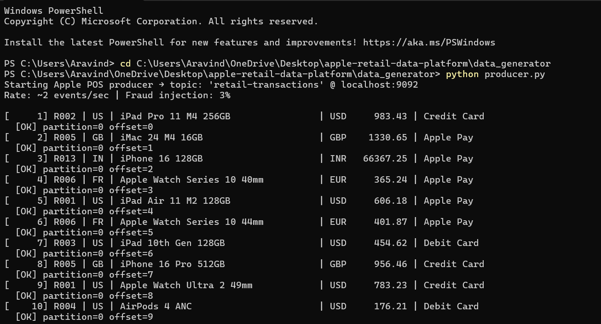

### Event Schema

```json
{
  "transaction_id": "a3f7c2d1-...",
  "event_time": "2026-03-28T08:27:13Z",
  "store_id": "R006",
  "country": "FR",
  "currency": "EUR",
  "product_name": "iPhone 16 128GB",
  "unit_price": 735.69,
  "quantity": 1,
  "total_amount": 735.69,
  "payment_method": "Apple Pay"
}
```

### Key Design Decisions

| Feature | What It Does | Why It Matters |
|---|---|---|
| Weighted product distribution | iPhones appear more than Mac Pros | Simulates real demand curves, not uniform randomness |
| Globalization | 10 countries, 10 currencies per transaction | Enables geo analytics and currency normalization |
| Dynamic pricing | Currency conversion + slight price variation | Reflects real-world regional pricing behavior |
| Fraud injection | Zero, negative, and extreme-value anomalies | Prepares pipeline for fraud detection use cases |
| UUID identifiers | Every transaction has a unique ID | Prevents duplication, enables end-to-end traceability |
| UTC timestamps | All events use UTC | Ensures consistency across global time zones |
| Continuous streaming | `while True` loop — 2 events/sec | Simulates actual retail operations, not a batch dump |

---

# 🧪 Phase 1 — QA Testing

## QA Suite (`test_producer.py`)

Validates every transaction before it enters the pipeline — schema correctness, price integrity, and fraud detection.

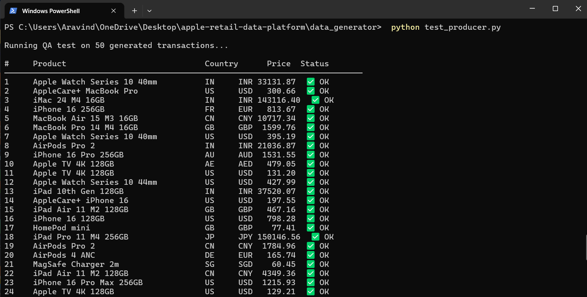
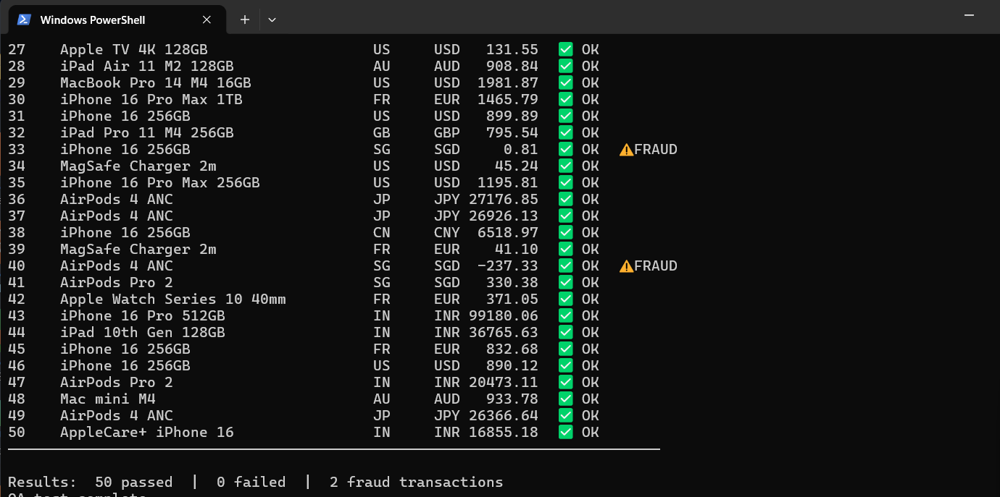

### Validations

- ✅ All required fields present
- ✅ Unit price is a positive number
- ✅ `total_amount == unit_price × quantity`
- ✅ Fraud anomalies flagged — not silently passed through

**Result: 50 passed | 0 failed | 2 fraud transactions detected**

Transaction 33 (SGD 0.81) and transaction 40 (SGD −237.33) were intentionally injected anomalies — both correctly identified before reaching the stream.

> Catching bad data at the source is far cheaper than debugging it downstream in Spark or the warehouse.

---

# ⚙️ Phase 2 — Streaming Infrastructure

## Redpanda (Kafka-Compatible) + Docker

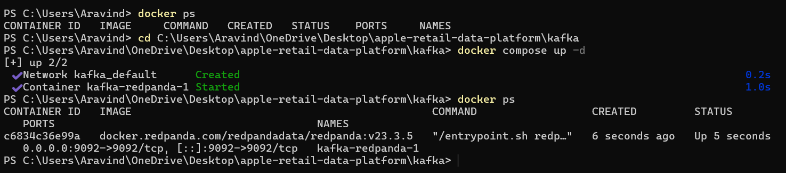

### Kafka Internal Architecture

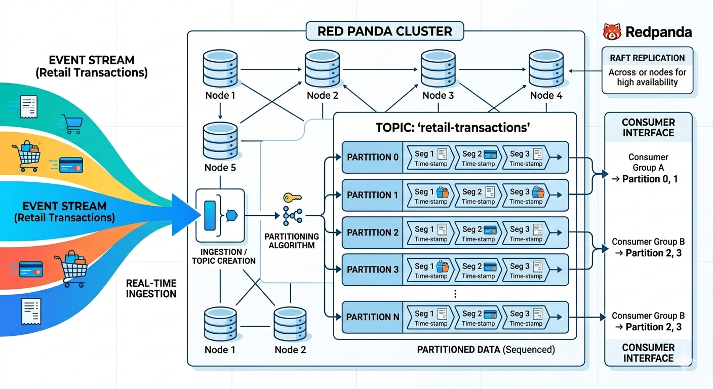

The diagram above shows how retail transaction events flow into the Redpanda cluster — ingested through topic creation, distributed across partitions via a partitioning algorithm using `store_id` as the key, replicated across nodes using Raft consensus for high availability, and consumed by multiple independent consumer groups.

### Why Redpanda instead of Apache Kafka?

Traditional Kafka requires Zookeeper, complex configuration, and multiple dependent services. Redpanda gives the same Kafka API with no Zookeeper, single-binary deployment, and faster startup — the right trade-off for a local simulation environment.

### Topic Design

- **Topic:** `retail-transactions`
- **Partition key:** `store_id`

Using `store_id` as the partition key guarantees all events from a given store land in the same partition — preserving per-store event ordering and enabling efficient parallel processing downstream.

### Why Kafka Before Spark?

Kafka acts as a fault-tolerant buffer between producer and processing engine. Producers and consumers scale independently — this is the core principle of event-driven architecture used at Uber, Netflix, and Amazon.

---

# ⚡ Phase 3 — Spark Structured Streaming

Reads the live Kafka stream, parses raw JSON bytes into a typed schema, and processes transactions in real-time micro-batches.

### Spark Streaming Internal Architecture

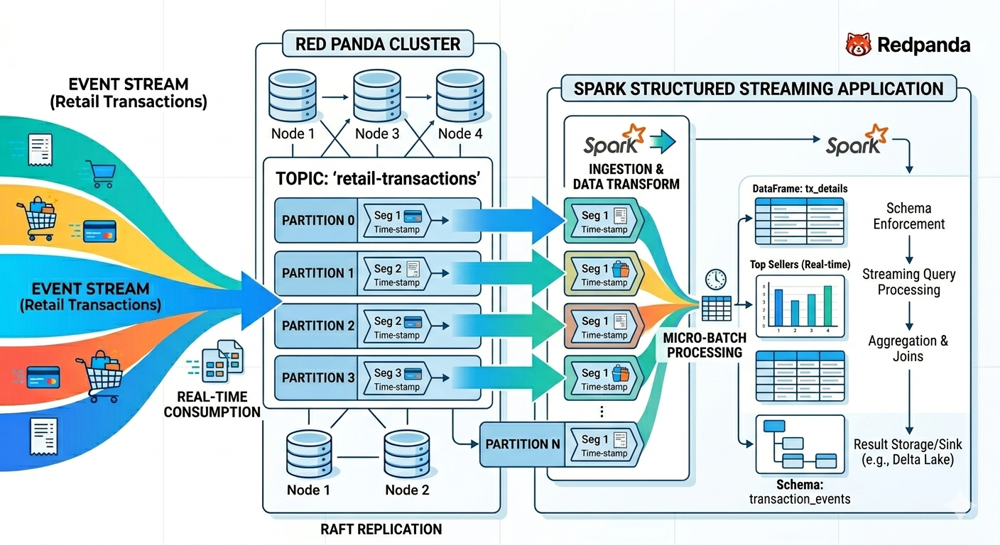

The diagram above shows how Spark consumes from Redpanda partitions in real time — each partition is consumed in parallel, micro-batch processing applies schema enforcement, streaming query processing, and aggregation, and results are written to the data lake sink.

### Key Config

```python
spark = SparkSession.builder \
    .appName("AppleRetailStreaming") \
    .config("spark.jars.packages", "org.apache.spark:spark-sql-kafka-0-10_2.12:3.5.3") \
    .getOrCreate()
```

---

# 🗄️ Phase 4 — Data Lake (Bronze / Silver / Gold)

## Bronze Layer — Raw Archive

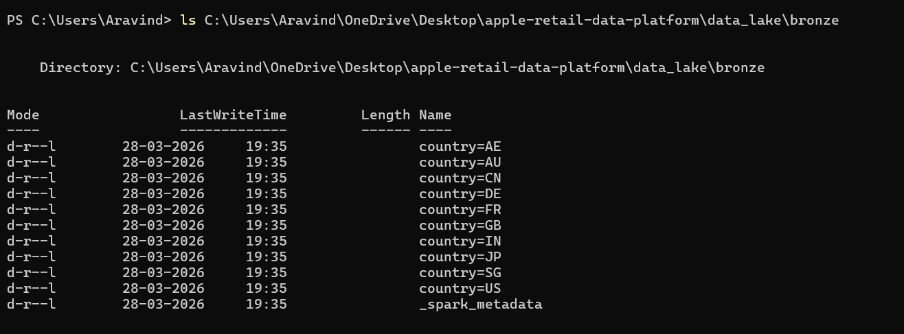

Raw data exactly as it arrives from Kafka — permanently archived as Parquet files, partitioned by country. No transformations. This is the source of truth — if anything fails downstream, reprocess from Bronze.

## Silver Layer — Cleaned Data

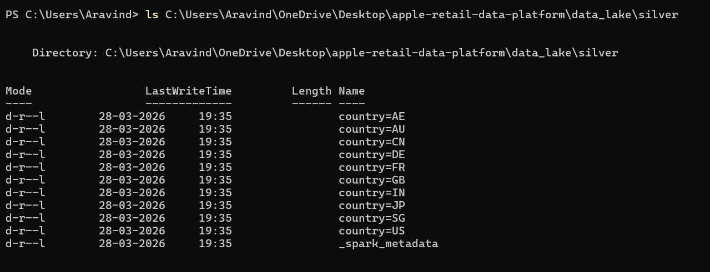

Spark applies 5 cleaning rules before writing:

- Converts `event_time` string → proper timestamp
- Adds `processed_time` column
- Removes null/corrupt records
- Removes fraud (price ≤ 0 or negative)
- Filters impossible values (quantity ≤ 0)

## Gold Layer — Business Metrics

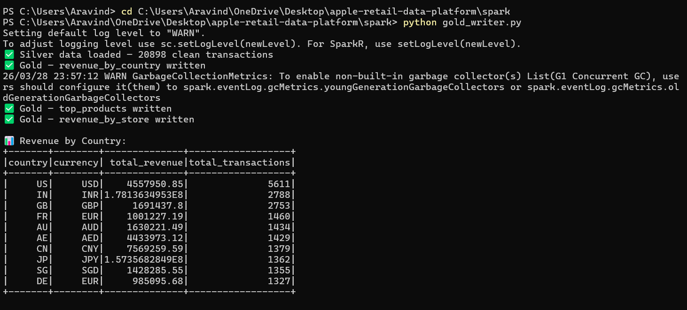
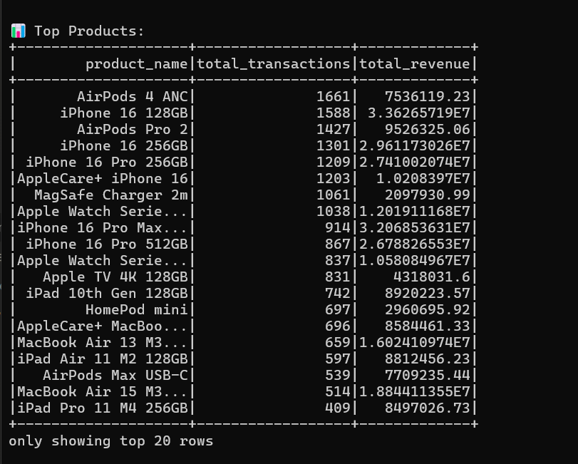
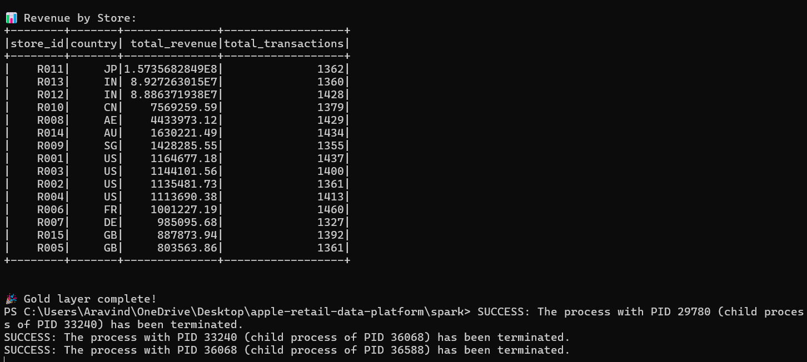

Spark reads Silver and produces 3 aggregated business tables — revenue by country, top products by transaction volume, and store performance rankings.

**20,898 clean transactions processed | AirPods 4 ANC top seller | R006 busiest store**

---

# 🦆 Phase 5 — DuckDB Warehouse

Queries Gold Parquet files directly with SQL — no loading, no importing, instant results.

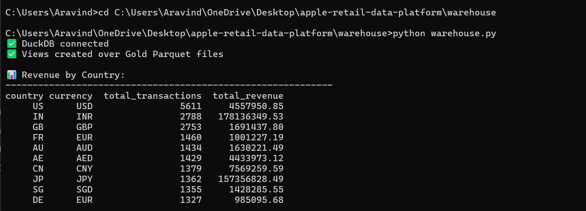
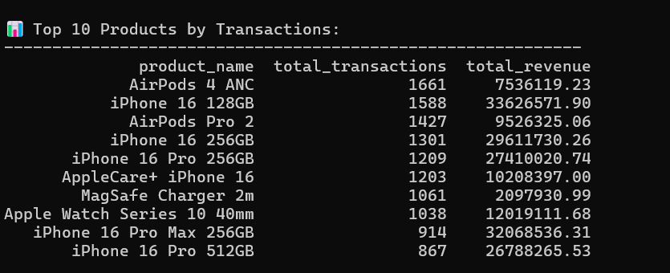
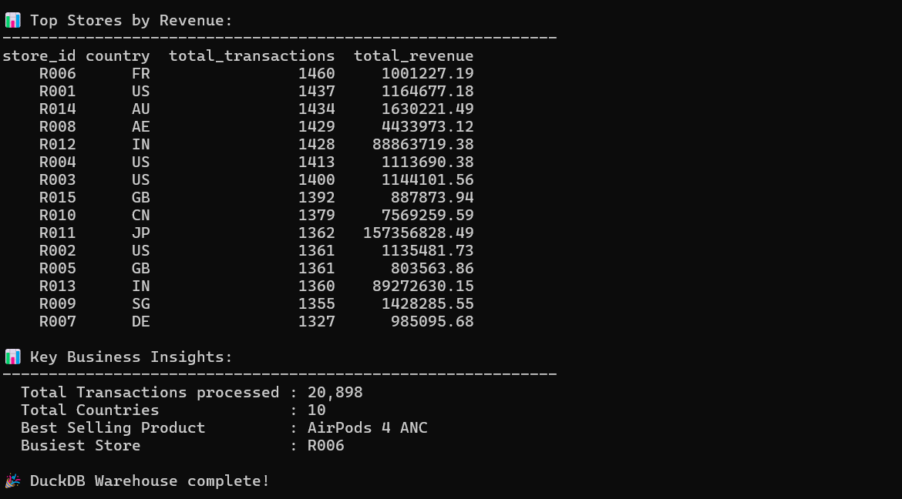

```python
con.execute(f"""
    CREATE OR REPLACE VIEW top_products AS
    SELECT * FROM read_parquet('{GOLD_PATH}/top_products/*.parquet')
""")
```

### Key Business Insights

```
Total Transactions   : 20,898
Total Countries      : 10
Best Selling Product : AirPods 4 ANC
Busiest Store        : R006 (France)
```

---

# 📊 Phase 6 — Streamlit Live Dashboard

Built in Python, connected directly to the Gold layer through DuckDB, auto-refreshing every 30 seconds.

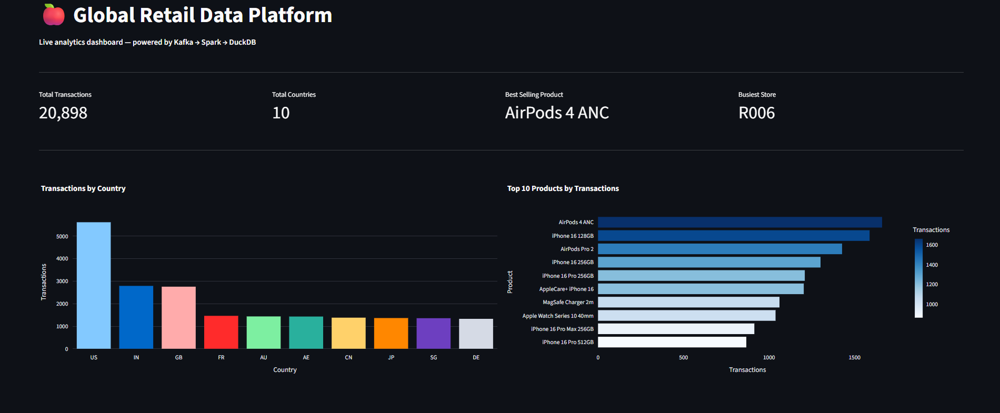
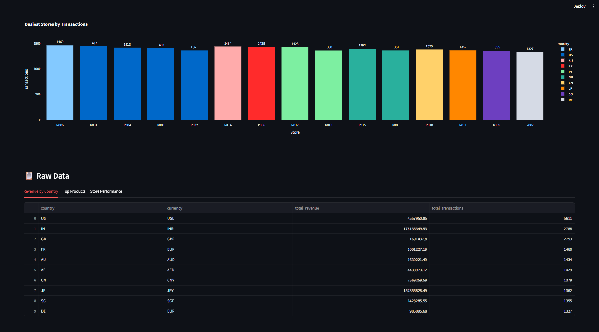

### Features

- 4 KPI cards — Total Transactions, Countries, Best Seller, Busiest Store
- Transactions by Country bar chart
- Top 10 Products horizontal bar chart
- Busiest Stores color-coded by country
- Raw data tables with tabs
- Last updated timestamp — visible proof of live refresh

### Run the Dashboard

```bash
cd dashboard
python -m streamlit run app.py
```

---

# 💡 What Makes This Different

| Typical Student Project | This Project |
|---|---|
| Static CSV files | Live continuous event stream |
| Uniform random data | Weighted realistic distributions |
| No validation | QA test suite before every stream |
| Single region | 10 countries, 10 currencies |
| No edge cases | Intentional fraud injection |
| Local script | Distributed containerized architecture |
| No storage layer | Bronze / Silver / Gold data lake |
| No analytics | DuckDB SQL warehouse |
| No visualization | Live auto-refreshing dashboard |

---

# 🚀 Getting Started

### Prerequisites

- Python 3.10+
- Docker Desktop with WSL2
- Java 8+ (for Spark)
- Apache Spark 3.5.3

### Installation

```bash
# Clone the repo
git clone https://github.com/aravindsanandin/Apple-Scale-Retail-Data-Platform
cd Apple-Scale-Retail-Data-Platform

# Install dependencies
pip install -r requirements.txt
```

### Run the Full Pipeline

```bash
# 1. Start Redpanda
cd kafka
docker compose up -d

# 2. Start Producer (new terminal)
cd data_generator
python producer.py

# 3. Run Bronze Writer (new terminal, 60 seconds)
cd spark
python bronze_writer.py

# 4. Run Silver Writer (new terminal, 60 seconds)
python silver_writer.py

# 5. Run Gold Writer
python gold_writer.py

# 6. Run DuckDB Warehouse
cd warehouse
python warehouse.py

# 7. Launch Dashboard
cd dashboard
python -m streamlit run app.py
```

---

# 🧠 Technical Stack

| Layer | Technology | Purpose |
|---|---|---|
| Data Generation | Python | POS simulation, fraud injection |
| Message Broker | Redpanda (Kafka) | Real-time event streaming |
| Stream Processing | Apache Spark 3.5.3 | Micro-batch processing, transformations |
| Storage Format | Parquet | Columnar, compressed, query-optimized |
| Data Lake | Bronze/Silver/Gold | Raw → Cleaned → Aggregated layers |
| Warehouse | DuckDB | Analytical SQL on Parquet files |
| Dashboard | Streamlit + Plotly | Live auto-refreshing visualization |
| Infrastructure | Docker + WSL2 | Containerized local environment |

---

## 📝 Note on Architecture

The architecture diagram references Apache Iceberg for the data lake layer. For local development on Windows, raw Parquet files with Spark partitioning are used instead — providing the same columnar storage and query performance. Iceberg would be the production choice on a cloud environment (AWS S3 + Glue catalog or Azure Data Lake).

---

## 👨‍💻 Author

Built as a production-grade data engineering project to demonstrate real-time retail analytics systems — from raw event generation through streaming, data lake, warehouse, and live visualization.

---

> 🎬 **Demo video:** [Watch here](https://youtu.be/WfVg-zzc0X0)
>
> ⭐ If you found this useful, please star the repo — it helps others discover it!
